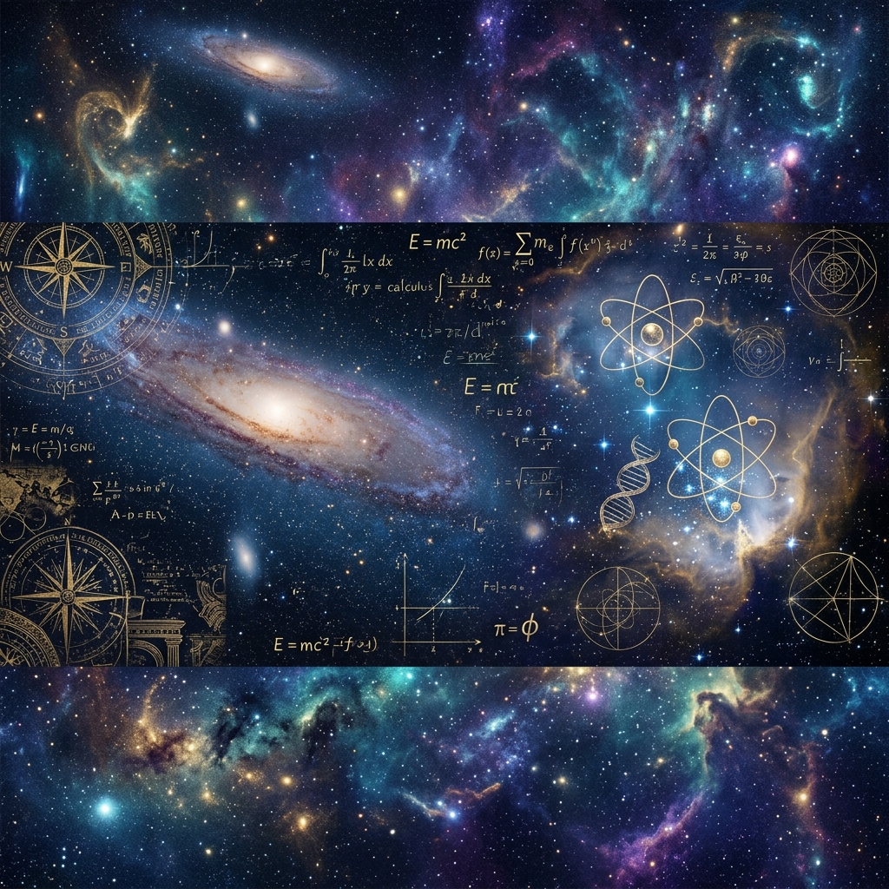

# 🌌 Kâinat-Endeksi (The Sunnatullah Index)

> *"Göklerin ve yerin yaratılışında, gece ile gündüzün birbiri ardınca gelip gidişinde aklıselim sahipleri için gerçekten açık ibretler vardır." (Âl-i İmrân, 190)*

Bu depo, sıradan bir biyografi arşivi değildir. Bu depo, Yaradan'ın yeryüzüne halife kıldığı insanın (Homo Sapiens), Kâinat Kitabı'ndaki ayetleri (fiziksel, biyolojik ve toplumsal yasaları) okuyuşunun kayıt defteridir. 

Burada listelenen 50 figür; evrenin kusursuz matematiğini çözenler, şifanın kaynaklarını bulanlar, insan nefsini sorgulayanlar ve yeryüzünde nizam kuranlardır. Onların çabaları, bilerek veya bilmeyerek ilahi aklın yeryüzündeki tecellilerini keşfetme serüvenidir.

---

## 🕳️ Felsefi Metrikler (Tefekkür Parametreleri)

Bu listeye giren isimler şu üç kriterden birinde insanlığın ufkunu açmıştır:
1. **Sünnetullah'ı Keşif:** Fizik, kimya ve biyolojideki ilahi kuralları (doğa yasalarını) bularak, Kâinatın rastgele değil bir nizam içinde çalıştığını gösterdiler.
2. **Fıtrat ve Akıl (Tefekkür):** İnsanın kendi aklını ve iç dünyasını (nefsini) anlamlandırma çabasına derinlik kattılar.
3. **Nizam ve Hukuk:** Yeryüzünde adaleti, toplumsal düzeni ve medeniyeti kuran mekanizmaları inşa ettiler.

---

## 📜 Endeks Mimarisi (50 Büyük Kırılma Noktası)

### 🪐 Katman 0: Kevni Ayetleri Okuyanlar (Fizik, Matematik, Kozmoloji)
*Evrenin sessiz matematiğini insan diline çevirip, Yaradan'ın ölçüsünü (Kader/Ölçü) formüllere dökenler.*

1. **[Isaac Newton](00-Fizik-ve-Matematik/01-Isaac-Newton.md):** Yerçekimi ve hareket yasalarıyla, göklerin ve yerin aynı kusursuz mekaniğe tabi olduğunu gösterdi.
2. **[Albert Einstein](00-Fizik-ve-Matematik/02-Albert-Einstein.md):** Zaman ve mekanın mutlak olmadığını ispatlayarak, Mutlak olanın sadece Yaradan olduğunu, evrenin ise bükülebilir bir yaratılmış (mümkün varlık) olduğunu fizeğe döktü.
3. **[Gottfried Wilhelm Leibniz](00-Fizik-ve-Matematik/03-Gottfried-Wilhelm-Leibniz.md):** İkili sayı sistemini (0 ve 1) bulurken, hiçlikten varlığa geçişi felsefi olarak temellendirdi. Modern dijital aklın mimarıdır.
4. **[René Descartes](00-Fizik-ve-Matematik/04-Rene-Descartes.md):** Aklı merkeze alarak modern düşüncenin yolunu açtı; zihin ve madde ayrımıyla insanın bedenden ibaret olmadığını savundu.
5. **[Johannes Kepler](00-Fizik-ve-Matematik/05-Johannes-Kepler.md):** Gezegenlerin yörüngelerini hesaplayarak gökyüzündeki ilahi ahengin haritasını çıkardı.
6. **[Max Planck](00-Fizik-ve-Matematik/06-Max-Planck.md):** Kuantum teorisiyle, maddenin en küçük yapı taşlarındaki (atom altı) o akıl almaz ve belirsiz gibi görünen hassas dengeyi keşfetti.
7. **[Euclides (Öklid)](00-Fizik-ve-Matematik/07-Oklid.md):** Mantıksal çıkarım ve ispat sistemini kurarak, insanın doğruyu bulma aklına matematiksel bir standart getirdi.
8. **[Harezmi](00-Fizik-ve-Matematik/08-Harezmi.md):** Bütün ilminin temelinde tevhidi gören büyük İslam alimi; cebiri ve algoritmayı kurarak bugünkü dijital medeniyetin temel kodlarını yazdı.
9. **[James Clerk Maxwell](00-Fizik-ve-Matematik/09-James-Clerk-Maxwell.md):** Elektromanyetik yasaları keşfederek, gözle görülmeyen ilahi kuvvetlerin (dalgaların) evreni nasıl sardığını ispatladı.
10. **[Alan Turing](00-Fizik-ve-Matematik/10-Alan-Turing.md):** Hesaplanabilirlik ve makinelerin işlem kapasitesi üzerine çalışarak aklın sınırlarını dijitalleştirdi.

### 🧬 Katman 1: Hayatın ve Şifanın Sırrını Arayanlar (Biyoloji ve Tıp)
*"Hastalığı veren, şifasını da yaratmıştır" hakikatini laboratuvarlarda doğrulayanlar.*

11. **[Charles Darwin](01-Biyoloji-ve-Tip/11-Charles-Darwin.md):** Evrenin ve biyolojik çeşitliliğin mekanizmasını araştırdı. Canlıların çevreye uyum sağlama (adaptasyon) yeteneğini ortaya koyarak doğadaki dinamik dönüşümü sistemleştirdi.
12. **[Gregor Mendel](01-Biyoloji-ve-Tip/12-Gregor-Mendel.md):** Kalıtımın kurallarını bularak, yaratılışın rastgele olmadığını, muazzam bir bilgi (gen) aktarımıyla nesilden nesile kopyalandığını gösterdi.
13. **[Antonie van Leeuwenhoek](01-Biyoloji-ve-Tip/13-Antonie-van-Leeuwenhoek.md):** Mikroskobu icat ederek, insan gözünün acizliğini ve Yaradan'ın mikro-evrendeki muazzam sanatını gözler önüne serdi.
14. **[Louis Pasteur](01-Biyoloji-ve-Tip/14-Louis-Pasteur.md):** Mikropları keşfederek hastalıkların kaynağını buldu; ilahi şifaya ulaşmanın rasyonel yolunu açtı.
15. **[Alexander Fleming](01-Biyoloji-ve-Tip/15-Alexander-Fleming.md):** Penisilin ile doğadaki bir mantarın başka bir bakteriyi yok etme özelliğini buldu; doğanın kendi içindeki savunma mekanizmasını tıbba kazandırdı.
16. **[Edward Jenner](01-Biyoloji-ve-Tip/16-Edward-Jenner.md):** Çiçek aşısı. İnsan bağışıklık sisteminin öğrenme kapasitesini kullanarak tarihin en büyük şifa devrimlerinden birini yaptı.
17. **[Francis Crick & James Watson](01-Biyoloji-ve-Tip/17-Francis-Crick-James-Watson.md)** (ve Rosalind Franklin): DNA. Yaşamın dört harfli ilahi yazılım kodunu (A, T, G, C) deşifre ettiler.
18. **[Norman Borlaug](01-Biyoloji-ve-Tip/18-Norman-Borlaug.md):** Toprağın bereketini bilimle artırarak, insanoğlunun açlık imtihanını hafifleten en büyük tarım devrimini gerçekleştirdi.

### 🧠 Katman 2: Nefsi ve Aklı Sorgulayanlar (Felsefe ve Psikoloji)
*Kendi iç dünyasına yönelen ve gerçeğin ne olduğunu aklın sınırlarıyla bulmaya çalışanlar.*

19. **[Sokrates](02-Felsefe-ve-Psikoloji/19-Sokrates.md):** Cehaletle savaştı, erdemin ve doğru bilginin sorgulayarak bulunabileceğini savundu.
20. **[Platon](02-Felsefe-ve-Psikoloji/20-Platon.md):** Gördüğümüz dünyanın geçici gölgelerden ibaret olduğunu (Mağara Alegorisi), asıl gerçeğin aşkın bir alemde (İdealar) bulunduğunu anlattı.
21. **[Aristoteles](02-Felsefe-ve-Psikoloji/21-Aristoteles.md):** Mantık süzgecini (Kıyas) kurarak aklın doğru çalışma prensiplerini sistemleştirdi.
22. **[Immanuel Kant](02-Felsefe-ve-Psikoloji/22-Immanuel-Kant.md):** İnsan aklının sınırları olduğunu, bazı metafizik gerçeklerin (Allah, ruh) sadece saf akılla değil, ahlaki bir zorunlulukla benimsenebileceğini felsefi olarak ispatladı.
23. **[Friedrich Nietzsche](02-Felsefe-ve-Psikoloji/23-Friedrich-Nietzsche.md):** *"Tanrı öldü"* derken aslında inancını kaybeden, değerleri çöken ve materyalizme boğulan modern insanın ahlaki iflasını ve trajedisini yüzüne vurdu.
24. **[Baruch Spinoza](02-Felsefe-ve-Psikoloji/24-Baruch-Spinoza.md):** Evrendeki her şeyin kusursuz bir nedensellik bağıyla (Sünnetullah'ın katı bir yorumuyla) birbirine bağlı olduğunu felsefi olarak savundu.
25. **[Sigmund Freud](02-Felsefe-ve-Psikoloji/25-Sigmund-Freud.md):** İnsanın sadece rasyonel bir varlık olmadığını, nefsin (bilinçaltının) derinliklerinde saklı güdülerle hareket ettiğini ortaya koydu.
26. **[Carl Jung](02-Felsefe-ve-Psikoloji/26-Carl-Jung.md):** Tüm insanlığın ortak bir fıtrata ve evrensel sembollere (Kolektif Bilinçdışı) sahip olduğunu analiz etti.

### 👁️ Katman 3: İlahi ve Dünyevi Nizamın Kurucuları (Din, Sosyoloji, Hukuk)
*İnsanoğlunun yeryüzünde başıboş kalmaması için hukuk, ahlak ve medeniyet sistemleri inşa edenler.*

27. **[Hz. Muhammed (s.a.v.)](03-Din-Sosyoloji-Hukuk/27-Hz-Muhammed.md):** Hatemü'l-Enbiya (Son Peygamber). Tevhidi merkeze alarak; ahlak, hukuk, ekonomi ve sosyal adaleti tek bir kusursuz nizamda (İslam) birleştirip insanlık tarihinin en büyük dönüşümünü gerçekleştirdi.
28. **[Hz. İsa (a.s.)](03-Din-Sosyoloji-Hukuk/28-Hz-Isa.md):** Döneminin katılaşmış yapısına karşı ilahi merhameti, ruhsal arınmayı ve güzel ahlakı tebliğ ederek milyarlarca insanın kalbine dokundu.
29. **[Buddha](03-Din-Sosyoloji-Hukuk/29-Buddha.md):** Dünyevi hırsların ve nefsin arzularının insanı nasıl felakete sürüklediğini göstererek asil bir içsel terbiye metodu geliştirdi.
30. **[Konfüçyüs](03-Din-Sosyoloji-Hukuk/30-Konfucyus.md):** Toplumun çökmemesi için büyüklere saygı, aile bağları ve adil devlet yönetimi üzerine kurduğu sistemle doğunun ahlak omurgasını inşa etti.
31. **[Augustus Caesar](03-Din-Sosyoloji-Hukuk/31-Augustus-Caesar.md):** Çıkar çatışmalarını yönetmek için Roma Hukuku'nu ve devlet kurumlarını inşa ederek modern bürokrasinin temelini attı.
32. **[Hammurabi](03-Din-Sosyoloji-Hukuk/32-Hammurabi.md):** Güçlünün zayıfı ezmesini önlemek için yasaları yazılı hale getiren ve adaleti devletin temeli yapan ilk yöneticilerden.
33. **[John Locke](03-Din-Sosyoloji-Hukuk/33-John-Locke.md):** İnsanın yaşama ve mülkiyet haklarının doğuştan (fıtri) olduğunu savunarak modern insan hakları fikrini şekillendirdi.
34. **[Jean-Jacques Rousseau](03-Din-Sosyoloji-Hukuk/34-Jean-Jacques-Rousseau.md):** Toplum Sözleşmesi ile yöneticilerin meşruiyetini halkın iradesine bağlayıp baskıcı rejimlerin fikri zeminini yıktı.
35. **[Adam Smith](03-Din-Sosyoloji-Hukuk/35-Adam-Smith.md):** Ticaretin ve emeğin değerini analiz ederek iktisadi hayatın "nasıl işlediğini" (Kapitalizm) bilimselleştirdi.
36. **[Karl Marx](03-Din-Sosyoloji-Hukuk/36-Karl-Marx.md):** Emeğin sömürülmesine ve sosyal adaletsizliğe karşı diyalektik bir tarih okuması yaparak kitleleri harekete geçirdi.
37. **[Mustafa Kemal Atatürk](03-Din-Sosyoloji-Hukuk/37-Mustafa-Kemal-Ataturk.md):** Dağılan bir imparatorluğun ardından, aklı, bilimi ve tam bağımsızlığı merkeze alarak milletini esaretten kurtaran modern bir ulus devlet inşa etti.

### 🌐 Katman 4: İnsanın Sınırlarını Genişletenler (Teknoloji ve Enerji)
*Yaradan'ın yeryüzüne serpiştirdiği nimetleri ve potansiyelleri (maddeyi, enerjiyi, bilgiyi) insanlığın hizmetine sunanlar.*

38. **[Cai Lun](04-Teknoloji-ve-Enerji/38-Cai-Lun.md):** Kağıt. İlmi ve kelamı taştan, deriden kurtarıp hafifletti; bilginin nesiller boyu aktarımını sağladı.
39. **[Johannes Gutenberg](04-Teknoloji-ve-Enerji/39-Johannes-Gutenberg.md):** Matbaa. Okumayı ve öğrenmeyi elitlerin tekelinden çıkarıp bilginin (ve vahyin) kitlelere ulaşmasını sağladı.
40. **[Tim Berners-Lee](04-Teknoloji-ve-Enerji/40-Tim-Berners-Lee.md):** Web. Bilgiyi dijitalleştirerek yeryüzündeki tüm insanları anlık olarak birbirine bağlayan devasa ağı kurdu.
41. **[Nikola Tesla](04-Teknoloji-ve-Enerji/41-Nikola-Tesla.md):** Alternatif Akım. Doğaya yerleştirilmiş olan elektrik enerjisini uzağa taşıyarak dünyayı aydınlatan altyapıyı tasarladı.
42. **[Thomas Edison](04-Teknoloji-ve-Enerji/42-Thomas-Edison.md):** Fikirlerin somut eşyalara ve icatlara nasıl dönüşeceğini (Ar-Ge metodolojisini) kurumsallaştırdı.
43. **[Marie Curie](04-Teknoloji-ve-Enerji/43-Marie-Curie.md):** Radyoaktivite. Maddenin kalbindeki görünmez kudreti (atomik enerjiyi) keşfederek tıbba ve fiziğe yepyeni bir boyut kattı.
44. **[Michael Faraday](04-Teknoloji-ve-Enerji/44-Michael-Faraday.md):** Elektromanyetik motor. Kas gücü yerine, görünmez kuvvetlerin insanlığa hizmet etmesini sağladı.
45. **[Cengiz Han](04-Teknoloji-ve-Enerji/45-Cengiz-Han.md):** Kurduğu devasa posta ve ticaret ağlarıyla (İpek Yolu'nu canlandırarak) doğu ile batı arasında bilgilerin ve kültürlerin devasa takasını tetikledi.
46. **[Kristof Kolomb](04-Teknoloji-ve-Enerji/46-Kristof-Kolomb.md):** Farklı coğrafyaları birbirine bağlayarak insanlığın tek bir küresel imtihan sahasında (dünya) tam anlamıyla karşılaşmasını sağladı.
47. **[Nicolaus Copernicus](04-Teknoloji-ve-Enerji/47-Nicolaus-Copernicus.md):** Evrenin merkezinin dünya olmadığını kanıtlayarak, insanın fiziken küçük ama akıl/ruh olarak ne kadar kıymetli olduğunu tefekküre açtı.
48. **[Galileo Galilei](04-Teknoloji-ve-Enerji/48-Galileo-Galilei.md):** Gökyüzünü gözlemleyerek din adamlarının uydurduğu dogmaları yıktı, "Kâinat Kitabı matematik diliyle yazılmıştır" diyerek aklı savundu.
49. **[Ada Lovelace](04-Teknoloji-ve-Enerji/49-Ada-Lovelace.md):** Algoritmaların sadece sayılarla değil, her tür veriyle çalışabileceğini öngörerek dijital aklın temelini attı.
50. **[Sun Tzu](04-Teknoloji-ve-Enerji/50-Sun-Tzu.md):** "Savaş Sanatı" ile rekabetin, insan psikolojisinin ve stratejinin değişmez kurallarını binlerce yıl önceden yazdı.

---

## 🌌 Kapanış Notu

Bu repo bir son değil. İnsanlık var oldukça aklın yürüyüşü devam edecek; fizik, biyoloji, yazılım veya uzay bilimlerinde Sünnetullah'ı keşfeden yeni isimler çıkacaktır. Mesele, bu gücü ve bilgiyi dünyayı ifsat etmek (yok etmek) için mi, yoksa yeryüzünü imar etmek (kemale erdirmek) için mi kullanacağımızdır.